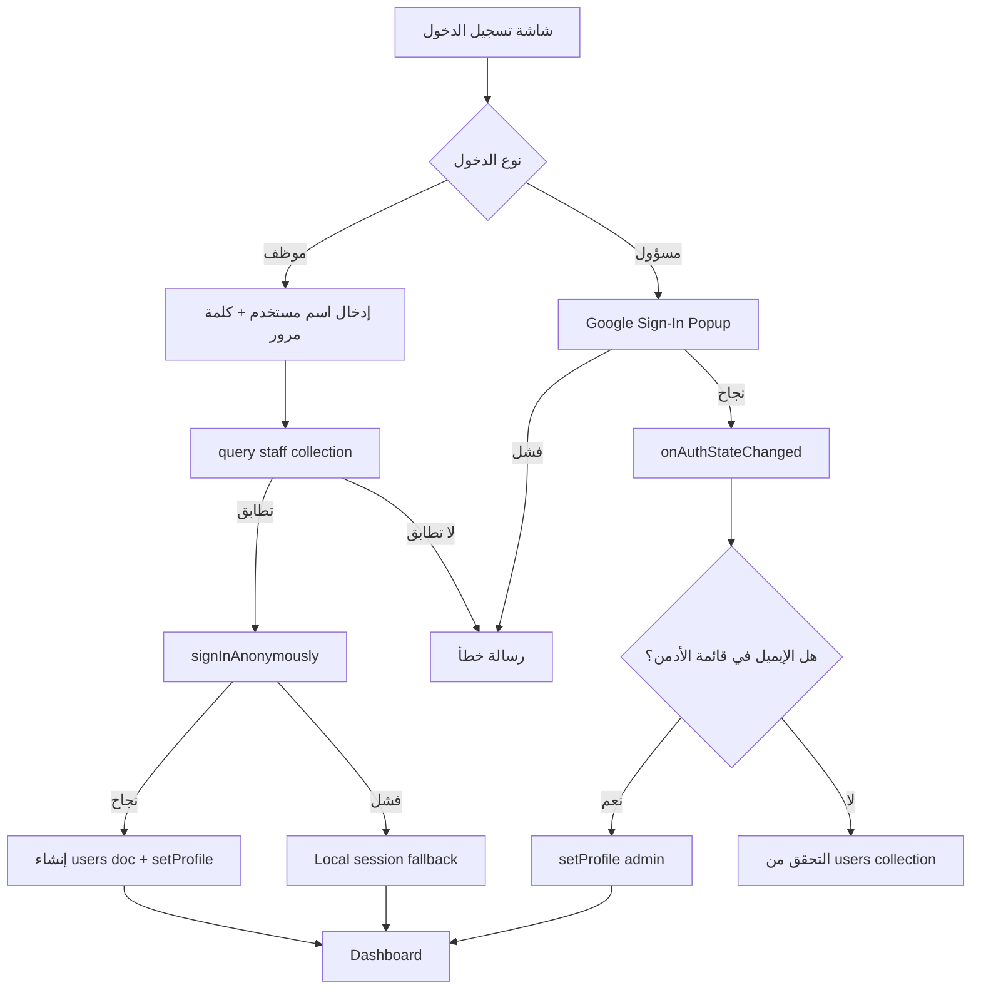

# 🏗️ معمارية التطبيق — Architecture

## 📐 نمط المعمارية العام

التطبيق يتبع نمط **Monolithic SPA** مع خادم Express بسيط:

```mermaid
graph TB
    subgraph "Client (Browser)"
        A[index.html] --> B[main.tsx]
        B --> C[AuthProvider]
        C --> D{مصادق؟}
        D -->|نعم| E[Dashboard.tsx]
        D -->|لا| F[Login Component]
    end

    subgraph "Server (server.ts)"
        G[Express.js] --> H[Vite Middleware - Dev]
        G --> I[Static Files - Prod]
        G --> J[/api/health]
    end

    subgraph "Firebase Cloud Services"
        K[Firestore Database]
        L[Firebase Auth]
    end

    E <-->|Real-time Listeners| K
    F <-->|Google/Anonymous Auth| L
    C <-->|onAuthStateChanged| L
```

## 🧱 طبقات التطبيق

### 1. طبقة العرض (Presentation Layer)
```
src/
├── App.tsx              ← المكوّن الجذر + شاشة الدخول
├── Dashboard.tsx        ← لوحة التحكم (1357 سطر - Monolithic)
└── components/ui/       ← مكونات Shadcn UI
```

**المكونات الداخلية في Dashboard.tsx:**

| المكوّن | النوع | الوظيفة |
|---------|-------|---------|
| `Dashboard` | رئيسي | لوحة التحكم الرئيسية مع جميع التبويبات |
| `KPICard` | عرض | بطاقة مؤشر أداء (إيرادات/تكاليف/ربح/حجوزات) |
| `NotificationCenter` | تفاعلي | مركز الإشعارات في الهيدر |
| `ActivityCard` | عرض | بطاقة عرض النشاط مع إحصائياته |
| `ActivityForm` | نموذج | نموذج إضافة نشاط جديد (Dialog) |
| `BookingForm` | نموذج | نموذج تسجيل حجز جديد (Dialog) |
| `CostForm` | نموذج | نموذج تسجيل مصروف (Dialog) |
| `FoundationalCostForm` | نموذج | نموذج تكلفة تأسيسية (Dialog) |
| `FoundationalCostsTab` | تبويب | عرض وإدارة التكاليف التأسيسية |
| `UserManagementTab` | تبويب | إدارة حسابات الموظفين (Admin only) |
| `ProfileTab` | تبويب | إعدادات الحساب الشخصي |

### 2. طبقة المنطق (Logic Layer)
```
src/
├── AuthContext.tsx       ← إدارة حالة المصادقة (React Context)
├── types.ts             ← أنماط TypeScript
└── services/
    └── notificationService.ts  ← منطق الإشعارات
```

### 3. طبقة البنية التحتية (Infrastructure Layer)
```
src/lib/
├── firebase.ts          ← تهيئة Firebase SDK + معالجة الأخطاء
└── utils.ts             ← دالة cn() لدمج CSS classes
```

## 🧩 تبويبات لوحة التحكم (Dashboard Tabs)

```
┌────────────────────────────────────────────────────────────────┐
│ Header: Logo + العنوان | الإشعارات 🔔 | ملف المستخدم ▼        │
├────────────────────────────────────────────────────────────────┤
│ نظرة عامة │ الأنشطة │ الحجوزات │ المالية │ التأسيس │ حسابي │ الموظفين* │
├────────────────────────────────────────────────────────────────┤
│                                                                │
│  [محتوى التبويب النشط]                                        │
│                                                                │
└────────────────────────────────────────────────────────────────┘
* تبويب الموظفين يظهر فقط للمسؤول (Admin)
```

### تفصيل كل تبويب:

#### 1. نظرة عامة (Overview)
- **بطاقات KPI**: إيرادات، تكاليف، صافي ربح، حجوزات نشطة
- **قائمة الأنشطة القادمة** مع إحصائيات
- **مخطط حالة الحجوزات** (مدفوع/مجاني/غير مدفوع) — Bar Chart
- البطاقات قابلة للتخصيص عبر `dashboardLayout` في إعدادات المستخدم

#### 2. الأنشطة (Activities)
- شبكة بطاقات (Grid) لعرض جميع الأنشطة
- كل بطاقة تعرض: الحالة، التاريخ، الحضور، الربح

#### 3. الحجوزات (Bookings)
- جدول بجميع الحجوزات مع التصفية
- أعمدة: الاسم، النشاط، العدد، الحالة، المبلغ، المستلم، إجراءات
- إجراءات: تأكيد الدفع، حذف

#### 4. المالية (Finances)
- جدول التكاليف والمصاريف (عامة + مرتبطة بنشاط)
- مخطط توزيع الأرباح لآخر 5 أنشطة (Bar Chart)

#### 5. التأسيس (Foundational)
- جدول التكاليف التأسيسية (بند، مبلغ، الدافع، المصدر، التاريخ)
- بطاقة إجمالي التكاليف التأسيسية

#### 6. حسابي (Profile)
- تعديل الاسم وصورة الحساب
- تغيير كلمة المرور
- إعدادات الإشعارات (حجوزات جديدة، تنبيه موعد، تنبيه تكاليف)
- تخصيص لوحة التحكم (إظهار/إخفاء بطاقات KPI)

#### 7. إدارة الموظفين (Users — Admin Only)
- جدول بجميع الموظفين
- إنشاء حسابات جديدة (اسم مستخدم + كلمة مرور + صلاحية)
- حذف حسابات

## 🔄 تدفق البيانات (Data Flow)

### الاستماع في الوقت الفعلي (Real-time Listeners)
```
Dashboard mount → useEffect
  ├── onSnapshot('activities')      → setActivities
  ├── onSnapshot('bookings')        → setBookings
  ├── onSnapshot('costs')           → setCosts
  ├── onSnapshot('foundationalCosts') → setFoundationalCosts
  ├── onSnapshot('staff') [Admin]   → setStaff
  ├── onSnapshot('notifications')   → setNotifications
  └── onSnapshot('userSettings')    → setSettings
```

### العمليات الكتابية
```
User Action → Firestore addDoc/updateDoc/deleteDoc → Real-time update
  ↓
[اختياري] → createNotification (إذا كان ينطبق)
  ↓
toast.success/error (إشعار مرئي فوري)
```

## 🔒 نظام المصادقة (Authentication Flow)



## 🧮 الحسابات المالية

```typescript
// إجمالي الإيرادات
totalRevenue = bookings.reduce((sum, b) => sum + (isPaid ? paidAmount : 0), 0)

// إجمالي التكاليف
totalCosts = costs.reduce((sum, c) => sum + c.amount, 0)

// صافي الربح
netProfit = totalRevenue - totalCosts

// إحصائيات نشاط واحد
getActivityStats(activityId) → { revenue, expense, profit, attendees, freeAttendees, paidAttendees }
```

## 📱 التوافق (Responsiveness)
- التصميم متجاوب: mobile-first
- Grid يتحول من 1 عمود (mobile) → 2 (tablet) → 4 (desktop)
- Header يتكيف: أزرار مكدسة على الموبايل، صف أفقي على الديسكتوب
- الجداول تبقى كما هي (مع إمكانية التمرير أفقياً ضمنياً)

## 🎨 مكونات Shadcn UI المستخدمة

### موجودة كملفات مخصصة (في `src/components/ui/`)
- `dropdown-menu.tsx` — مبني على `@base-ui/react/menu`
- `sonner.tsx` — مبني على `sonner`
- `switch.tsx` — مبني على `@base-ui/react/switch`

### مستوردة من حزمة `shadcn` مباشرة (ليس لها ملفات محلية)
- `Button`
- `Card`, `CardContent`, `CardHeader`, `CardTitle`, `CardDescription`
- `Tabs`, `TabsContent`, `TabsList`, `TabsTrigger`
- `Input`
- `Label`
- `Select`, `SelectContent`, `SelectItem`, `SelectTrigger`, `SelectValue`
- `Table`, `TableBody`, `TableCell`, `TableHead`, `TableHeader`, `TableRow`
- `Badge`
- `Dialog`, `DialogContent`, `DialogHeader`, `DialogTitle`, `DialogTrigger`, `DialogFooter`
- `ScrollArea`
- `Separator`

## ⚡ أنماط التصميم المستخدمة (Design Patterns)

1. **React Context Pattern** — لإدارة حالة المصادقة
2. **Real-time Listener Pattern** — اشتراكات Firestore بـ `onSnapshot`
3. **Controlled Component Pattern** — في النماذج (Forms)
4. **Compound Component Pattern** — في مكونات Shadcn (Tabs, Select, Dialog)
5. **Monolithic Component** — Dashboard.tsx يحتوي كل المنطق والمكونات
