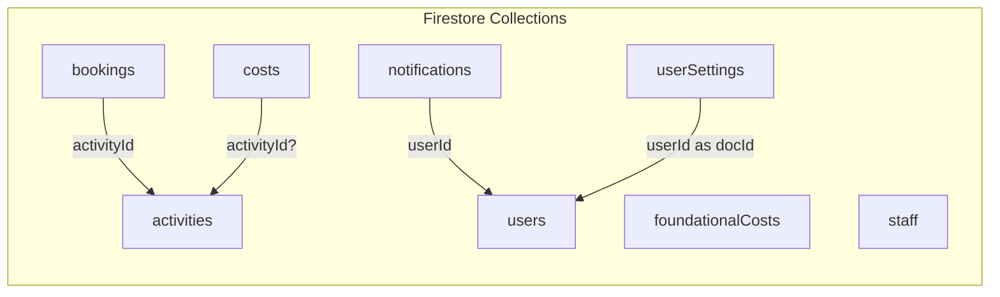

# 🗄️ قاعدة البيانات — Database Schema (Firestore)

## 🏢 نوع قاعدة البيانات
- **Firebase Firestore** — NoSQL Document Database
- **Project ID**: `gen-lang-client-0525125246`
- **Database ID**: `ai-studio-f72bac6b-7d71-412a-a5b5-0941f6e7e276`

## 📊 مخطط المجموعات (Collections)



---

## 📑 تفصيل كل مجموعة (Collection)

### 1. `activities` — الأنشطة (جلسات الألعاب)

**المسار**: `/activities/{activityId}`

| الحقل | النوع | مطلوب | الوصف |
|-------|-------|-------|-------|
| `name` | `string` | ✅ | اسم النشاط (1-200 حرف) |
| `date` | `Timestamp` | ✅ | تاريخ ووقت النشاط |
| `description` | `string` | ❌ | وصف النشاط |
| `basePrice` | `number` | ✅ | سعر التذكرة للشخص الواحد (≥ 0) |
| `status` | `string` (enum) | ✅ | الحالة: `planned` \| `active` \| `completed` \| `cancelled` |
| `createdAt` | `Timestamp` | ❌ | تاريخ الإنشاء |

**مثال وثيقة:**
```json
{
  "name": "ليلة المافيا الكبرى",
  "date": "2026-04-15T20:00:00Z",
  "description": "جلسة مافيا مع 20 لاعب",
  "basePrice": 10,
  "status": "planned",
  "createdAt": "2026-04-10T12:00:00Z"
}
```

---

### 2. `bookings` — الحجوزات

**المسار**: `/bookings/{bookingId}`

| الحقل | النوع | مطلوب | الوصف |
|-------|-------|-------|-------|
| `activityId` | `string` | ✅ | معرّف النشاط المرتبط (FK → activities) |
| `name` | `string` | ✅ | اسم الشخص الحاجز (1-100 حرف) |
| `phone` | `string` | ❌ | رقم الهاتف |
| `count` | `number` | ✅ | عدد الأشخاص (> 0) |
| `isPaid` | `boolean` | ✅ | هل تم الدفع؟ |
| `paidAmount` | `number` | ❌ | المبلغ المدفوع فعلياً |
| `receivedBy` | `string` | ❌ | من استلم المبلغ |
| `isFree` | `boolean` | ✅ | هل هو حجز مجاني (ضيف)؟ |
| `notes` | `string` | ❌ | ملاحظات إضافية |
| `createdAt` | `Timestamp` | ❌ | تاريخ الإنشاء |

**ملاحظات المنطق:**
- إذا `isFree = true` → يُعتبر `isPaid = true` تلقائياً و `paidAmount = 0`
- تأكيد الدفع يحسب: `paidAmount = basePrice × count`

**مثال وثيقة:**
```json
{
  "activityId": "abc123",
  "name": "أحمد",
  "phone": "0790000000",
  "count": 3,
  "isPaid": true,
  "paidAmount": 30,
  "receivedBy": "محمد",
  "isFree": false,
  "notes": "",
  "createdAt": "2026-04-10T14:00:00Z"
}
```

---

### 3. `costs` — التكاليف والمصاريف

**المسار**: `/costs/{costId}`

| الحقل | النوع | مطلوب | الوصف |
|-------|-------|-------|-------|
| `activityId` | `string` \| `null` | ❌ | معرّف النشاط (إذا كان مرتبطاً) |
| `item` | `string` | ✅ | وصف المصروف (1-200 حرف) |
| `amount` | `number` | ✅ | المبلغ (≥ 0) |
| `date` | `Timestamp` | ✅ | تاريخ المصروف |
| `paidBy` | `string` | ✅ | الشخص الذي دفع |
| `type` | `string` (enum) | ✅ | نوع المصروف: `activity` \| `general` |

**ملاحظات المنطق:**
- `type = 'general'` → مصروف عام (إيجار، قرطاسية...)
- `type = 'activity'` → مرتبط بنشاط معين عبر `activityId`
- تنبيه تلقائي إذا تجاوزت تكاليف نشاط معين إيراداته

**مثال وثيقة:**
```json
{
  "item": "ضيافة",
  "amount": 50,
  "date": "2026-04-10T00:00:00Z",
  "paidBy": "عبدالله",
  "type": "activity",
  "activityId": "abc123"
}
```

---

### 4. `foundationalCosts` — التكاليف التأسيسية

**المسار**: `/foundationalCosts/{costId}`

| الحقل | النوع | مطلوب | الوصف |
|-------|-------|-------|-------|
| `item` | `string` | ✅ | وصف البند |
| `amount` | `number` | ✅ | المبلغ (≥ 0) |
| `paidBy` | `string` | ✅ | الشخص الذي دفع |
| `source` | `string` | ✅ | مصدر التمويل (شخصي، قرض، شريك...) |
| `date` | `Timestamp` | ✅ | تاريخ المصروف |

**مثال وثيقة:**
```json
{
  "item": "تجهيز القاعة",
  "amount": 2000,
  "paidBy": "عبود",
  "source": "شخصي",
  "date": "2026-01-15T00:00:00Z"
}
```

---

### 5. `notifications` — الإشعارات

**المسار**: `/notifications/{notificationId}`

| الحقل | النوع | مطلوب | الوصف |
|-------|-------|-------|-------|
| `title` | `string` | ✅ | عنوان الإشعار |
| `message` | `string` | ✅ | محتوى الإشعار |
| `type` | `string` (enum) | ✅ | النوع: `new_booking` \| `upcoming_activity` \| `cost_alert` |
| `read` | `boolean` | ✅ | هل تمت القراءة؟ |
| `createdAt` | `Timestamp` | ✅ | تاريخ الإنشاء |
| `userId` | `string` | ✅ | معرّف المستخدم المستهدف |

**سيناريوهات الإشعارات:**
| السيناريو | النوع | الرسالة |
|-----------|-------|---------|
| حجز جديد | `new_booking` | `تم تسجيل حجز جديد لـ {name} في نشاط {activity}` |
| نشاط جديد | `upcoming_activity` | `تمت إضافة نشاط جديد: {name}` |
| تجاوز التكاليف | `cost_alert` | `تجاوزت تكاليف نشاط {name} إجمالي الإيرادات` |

---

### 6. `userSettings` — إعدادات المستخدم

**المسار**: `/userSettings/{userId}` (userId = document ID)

| الحقل | النوع | مطلوب | الوصف |
|-------|-------|-------|-------|
| `notifications` | `object` | ✅ | إعدادات الإشعارات |
| `notifications.newBooking` | `boolean` | ✅ | تنبيه حجز جديد |
| `notifications.upcomingActivity` | `boolean` | ✅ | تنبيه اقتراب موعد |
| `notifications.costAlert` | `boolean` | ✅ | تنبيه تجاوز تكاليف |
| `dashboardLayout` | `string[]` | ❌ | بطاقات KPI المعروضة |

**القيم الافتراضية:**
```json
{
  "notifications": {
    "newBooking": true,
    "upcomingActivity": true,
    "costAlert": true
  },
  "dashboardLayout": ["revenue", "costs", "profit", "bookings", "upcoming"]
}
```

---

### 7. `users` — المستخدمون

**المسار**: `/users/{userId}` (userId = Firebase Auth UID)

| الحقل | النوع | مطلوب | الوصف |
|-------|-------|-------|-------|
| `email` | `string` | ✅ | البريد الإلكتروني |
| `displayName` | `string` | ❌ | الاسم المعروض |
| `photoURL` | `string` | ❌ | رابط صورة الملف الشخصي |
| `role` | `string` (enum) | ✅ | الدور: `admin` \| `manager` |
| `createdAt` | `string` (ISO) | ❌ | تاريخ الإنشاء |
| `isAnonymous` | `boolean` | ❌ | هل هو مستخدم مجهول (موظف)؟ |

---

### 8. `staff` — حسابات الموظفين

**المسار**: `/staff/{staffId}`

| الحقل | النوع | مطلوب | الوصف |
|-------|-------|-------|-------|
| `username` | `string` | ✅ | اسم المستخدم |
| `password` | `string` | ✅ | كلمة المرور (نص عادي ⚠️) |
| `displayName` | `string` | ✅ | الاسم الكامل |
| `role` | `string` (enum) | ✅ | الدور: `admin` \| `manager` |
| `createdAt` | `Timestamp` \| `string` | ❌ | تاريخ الإنشاء |

**⚠️ تحذيرات أمنية:**
- كلمات المرور مخزنة كنص عادي (plaintext)
- المجموعة قابلة للقراءة بشكل عام (`allow read: if true`)
- حساب افتراضي: `username: admin` / `password: password123`

---

## 🔐 قواعد أمان Firestore

### الدوال المساعدة

| الدالة | الوظيفة | الحالة الحالية |
|--------|---------|---------------|
| `isAuthenticated()` | التحقق من وجود auth context | عادية |
| `isLocalOrAuthenticated()` | دائماً `true` | ⚠️ تصريحية مؤقتة |
| `isAdmin()` | تحقق من دور admin | تعتمد على `isLocalOrAuthenticated` |
| `isManager()` | تحقق من دور admin أو manager | تعتمد على `isLocalOrAuthenticated` |

### مصفوفة الصلاحيات

| المجموعة | قراءة | إنشاء | تعديل | حذف |
|----------|-------|-------|-------|-----|
| `activities` | Manager+ | Admin + Valid | Manager + Valid | Admin |
| `bookings` | Manager+ | Manager + Valid | Manager + Valid | Admin |
| `costs` | Manager+ | Manager + Valid | Manager + Valid | Admin |
| `foundationalCosts` | Manager+ | Admin + Valid | Admin + Valid | Admin |
| `notifications` | Owner/Local | Auth/Local | Owner/Local | Owner/Local |
| `userSettings` | Owner/Local | Owner/Local | Owner/Local | Owner/Local |
| `users` | Owner or Manager | Admin or Owner | Admin or Owner | Admin |
| `staff` | Public ⚠️ | Admin | — | Admin |

### دوال التحقق (Validation)

```
isValidActivity(data):
  - name: string, 1-200 chars
  - basePrice: number >= 0
  - status: in ['planned', 'active', 'completed', 'cancelled']

isValidBooking(data):
  - activityId: string
  - name: string, 1-100 chars
  - count: number > 0
  - isPaid: boolean
  - isFree: boolean

isValidCost(data):
  - item: string, 1-200 chars
  - amount: number >= 0
  - paidBy: string
  - type: in ['activity', 'general']

isValidFoundationalCost(data):
  - item: string, not empty
  - amount: number >= 0
  - paidBy: string
  - source: string
```

---

## 📈 الفهارس والاستعلامات (Indexes & Queries)

### الاستعلامات الرئيسية

| المجموعة | الترتيب | الفلتر |
|----------|---------|--------|
| `activities` | `date DESC` | — |
| `bookings` | `createdAt DESC` | — |
| `costs` | `date DESC` | — |
| `foundationalCosts` | `date DESC` | — |
| `staff` | `createdAt DESC` | — |
| `notifications` | `createdAt DESC` | `userId == currentUserId` |
| `staff` (login) | — | `username == X AND password == Y` |

### فهارس مركبة مطلوبة
```
notifications: userId ASC, createdAt DESC
staff: username ASC, password ASC (for login query)
```

---

## 🔗 العلاقات بين المجموعات

```
staff          → (يُنشئ)    → users (عبر Anonymous Auth UID)
users          → (يملك)     → userSettings (same userId as doc ID)
users          → (يستقبل)   → notifications (via userId field)
activities     → (يحتوي)    → bookings (via activityId in booking)
activities     → (يحتوي)    → costs (via activityId in cost, optional)
```

> **ملاحظة**: العلاقات هنا ليست Foreign Keys بالمعنى التقليدي، بل مراجع نصية (string references) بين المجموعات. لا يوجد enforcement على مستوى قاعدة البيانات.
